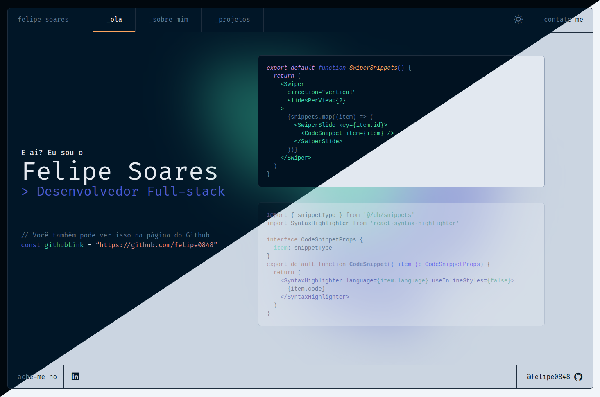
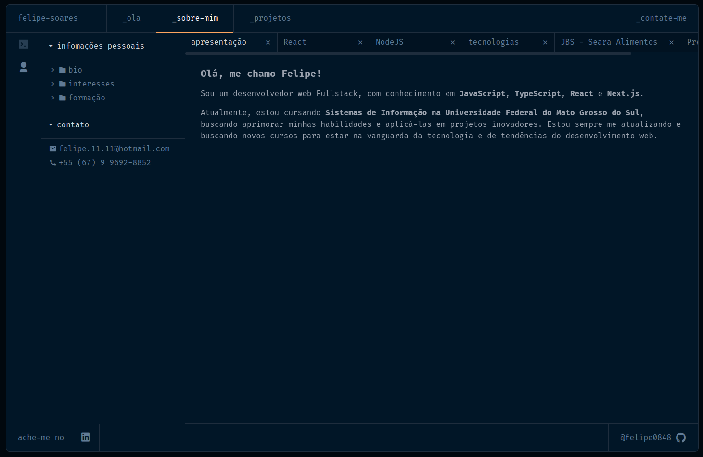
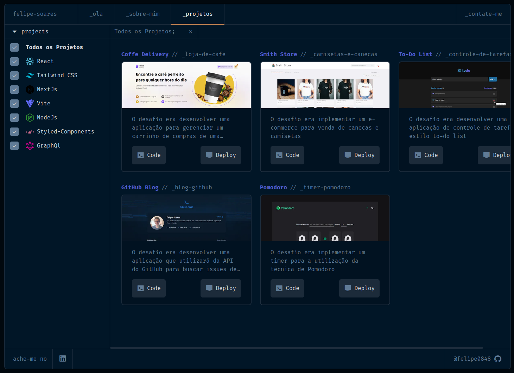
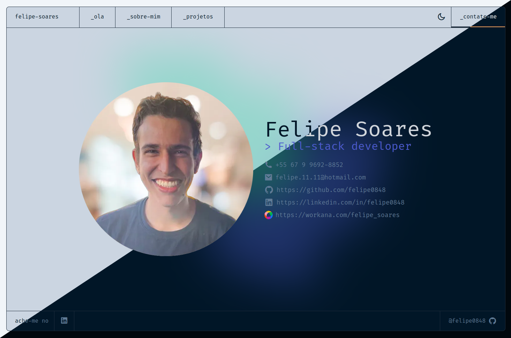

# Meu Portfolio

#### 🚀 Projeto Desenvolvido com Next, Typescript e Tailwind para a estilização.

O desafio era desenvolver um portifolio para gerenciar meus projetos com o intuito de exibi-los mais facilmente, que tivesse as seguintes abas:

-   [x] Listagem de todos os projetos desenvolvidos;
-   [x] Filtros para as tecnologias utilizadas em cada projeto;
-   [x] Conter links diretos para cada projeto ;
-   [x] Exibir detalhadamente cada projeto;
-   [x] Exibir um pouco de quem eu sou;
-   [x] Imitar a navegação de pastas de um editor de código;
-   [x] Adicionar alternador de tema (light mode e dark mode);
-   [ ] Adicionnar alternador de idioma (pt-br e en-us);

## 🖥️ Pré-requisitos e como rodar a aplicação/testes

Antes de começar, você vai precisar ter instalado em sua máquina as seguintes ferramentas:
[Git](https://git-scm.com)

### 📋 Instruções

-   Clone esse repositório `git clone`
-   Instale as dependências, `npm install`
-   No terminal, digite o comando `npm run dev`

## 🤖 Tecnologias Utilizadas

## 🖼️ Demonstração da aplicação

## 🚧 Status do projeto

Em construção

Visualização do site:
[Deploy na Vercel](https://portfolio-zeta-blond-20.vercel.app/)

## 🧑🏻‍ Autor

Feito por Felipe Soares

